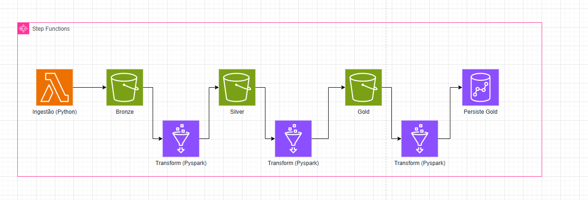

# Documentação do Projeto: Pipeline de Dados Cloud-Ready (Agrin)

## 1. Visão Geral

Este projeto implementa um pipeline de dados robusto seguindo a arquitetura **Data Lakehouse**, utilizando serviços da AWS. O objetivo é ingerir dados climáticos da API OpenWeather, processá-los através de camadas de qualidade (Bronze, Silver, Gold) e disponibilizá-los para análise em um Data Warehouse (Redshift).

## 2. Arquitetura e Tecnologias

A escolha da stack baseia-se em **escalabilidade** e **baixo custo operacional** (Serverless):

* **Linguagem:** Python 3.9+
* **Infraestrutura como Código (IaC):** Terraform
* **Ingestão (Bronze):** AWS Lambda (Serverless)
* **Processamento (Silver/Gold):** AWS Glue (PySpark)
* **Armazenamento:** AWS S3 (Data Lake)
* **Data Warehouse:** AWS Redshift Serverless
* **Orquestração:** AWS Step Functions



---

## 3. Implementação Passo a Passo

### Passo 1: Ingestão (Camada Bronze)

A função **AWS Lambda** é disparada para buscar dados brutos da API OpenWeather.

* **Conceito Aplicado:** *Raw Data Ingestion*. O dado é salvo exatamente como recebido (JSON) para garantir a rastreabilidade original.
* **Caminho S3:** `s3://[bucket]/datalake/bronze/`

### Passo 2: Limpeza e Normalização (Camada Silver)

O **AWS Glue** executa um job PySpark que lê os dados da Bronze.

* **Conceitos de Data Quality:**
* **Deduplicação:** Remoção de registros duplicados baseada em ID e Timestamp.
* **Tipagem Forte:** Conversão de strings para tipos numéricos e data (Timestamp).
* **Data Validation:** Filtro de registros com valores nulos em campos mandatórios (ex: temperatura).


* **Caminho S3:** `s3://[bucket]/datalake/silver/` (Formato Parquet)

### Passo 3: Agregação e Negócio (Camada Gold)

Ainda no Glue, os dados são transformados em métricas de negócio (ex: médias diárias por cidade).

* **Conceito de Integridade:** Os dados são salvos primeiro no S3 em Parquet antes de serem movidos para o banco de dados. Isso garante que, se o banco falhar, o dado processado não é perdido.
* **Caminho S3:** `s3://[bucket]/datalake/gold/`

### Passo 4: Persistência Final (Redshift)

Os dados da Gold são carregados via driver JDBC para o **Redshift Serverless**.

* **Conceito de Data Warehouse:** Disponibilização dos dados para ferramentas de BI (Tableau, PowerBI).

---

## 4. Aplicação de Conceitos de Engenharia de Dados

### Data Governance (Governança)

Implementada via **AWS IAM**. Criamos Roles específicas no arquivo `iam.tf` seguindo o **Princípio do Privilégio Mínimo**, garantindo que o Lambda só escreva na Bronze e o Glue só acesse o necessário.

### Data Lineage (Linhagem)

A linhagem é garantida pela separação física das camadas no S3. É possível rastrear um registro na Gold voltando para a Silver e encontrando seu arquivo original na Bronze.

### Monitoramento e Alertas

* **CloudWatch:** Logs detalhados de cada execução para depuração.
* **AWS Budgets:** Configuramos um alerta de custo de **$15 USD** no Terraform para evitar surpresas financeiras na conta AWS.

---

## 5. Como Executar o Projeto

### Pré-requisitos

* AWS CLI configurado com permissão de Administrador.
* Terraform instalado.
* Chave de API da OpenWeather.

### 1. Inicializar o Repositório

```bash
git init
terraform init

```

### 2. Configurar Variáveis

Crie um arquivo `terraform.tfvars` na pasta `infra/`:

```hcl
db_password         = "SuaSenhaForte123"
openweather_api_key = "SuaChaveAqui"
email_alerta        = "seu@email.com"

```

### 3. Aplicar Infraestrutura

```bash
terraform apply

```

---

## 6. Melhores Práticas Adotadas

1. **Idempotência:** O pipeline pode ser executado múltiplas vezes sem gerar dados duplicados inconsistentes.
2. **IaC (Infrastructure as Code):** Toda a infraestrutura é reprodutível via Terraform.
3. **Segurança:** Nenhuma credencial está "hardcoded" no código; usamos variáveis de ambiente e arquivos `.tfvars` (protegidos pelo `.gitignore`).
4. **Eficiência de Custo:** Uso de Parquet (colunar) para reduzir o volume de dados lidos e o custo de armazenamento.

---

Para completar a sua documentação, adicionei a seção **"7. Fluxo de Execução e CI/CD Manual"**. Esta parte é vital porque explica como o código que você escreveu efetivamente "roda" dentro da AWS, desde o trigger inicial até a carga no Redshift.

Aqui está o complemento para o seu README:

---

## 7. Execução do Pipeline (Passo a Passo)

O pipeline foi desenhado para ser totalmente automatizado através do **AWS Step Functions**, garantindo que a transformação (Glue) só inicie após o sucesso da ingestão (Lambda).

### 7.1. Orquestração com Step Functions

A máquina de estados (`infra/main.tf`) define o fluxo lógico:

1. **Task Ingestão:** Invoca a função Lambda `weather_ingestion.py`.
2. **Verificação:** Se a Lambda retornar sucesso, prossegue.
3. **Task ETL:** Inicia o Job do AWS Glue `spark_etl.py`.
4. **Monitoramento:** O Step Functions aguarda a finalização do Spark para marcar o pipeline como concluído.

### 7.2. Execução da Ingestão (Lambda)

O código `src/lambda/weather_ingestion.py` realiza as seguintes sub-etapas:

* **Request:** Conecta à API OpenWeather usando a `API_KEY`.
* **Parsing:** Converte o payload bruto em um objeto JSON.
* **S3 Upload:** Utiliza a biblioteca `boto3` para salvar o arquivo com um sufixo de timestamp em `bronze/weather_data_YYYYMMDD_HHMM.json`.

### 7.3. Execução do ETL (Spark/Glue)

O Job `src/glue/spark_etl.py` é o "músculo" do projeto:

* **Leitura Multi-Formato:** Lê todos os arquivos JSON da pasta `bronze`.
* **Data Quality & Schema Enforcement:**
* Filtra registros onde a temperatura é nula.
* Remove duplicatas baseadas no ID da cidade e no timestamp da leitura.
* Converte Kelvin para Celsius (Transformação de Negócio).

* **Escrita Silver (Parquet):** Salva o DataFrame limpo em `silver/` particionado por data.
* **Escrita Gold (Agregação):** Cria um novo DataFrame com as médias de temperatura por cidade e salva em `gold/`.
* **Carga Redshift:** Utiliza o conector JDBC do Spark para realizar o `COPY` ou `INSERT` dos dados da Gold para a tabela final no DW.

### 7.4. Comandos para execução manual

Caso deseje disparar o pipeline via terminal (CLI):

```bash
# Para iniciar todo o fluxo orquestrado
aws stepfunctions start-execution --state-machine-arn arn:aws:states:us-east-1:123456789012:stateMachine:desafio-agrin-orchestrator

# Para acompanhar os logs do Glue Spark em tempo real
aws glue get-job-run --job-name desafio-agrin-etl-silver-gold --run-id [RUN_ID]

```

---

## 8. Tratamento de Erros e Retentativas (Best Practices)

* **Lambda Timeout:** Configurado para 60 segundos, permitindo tempo suficiente para chamadas de API latentes.
* **Glue Retries:** O Job do Spark está configurado no Terraform para realizar até 3 retentativas automáticas em caso de falha de infraestrutura (Spot instances ou rede).
* **Logs:** Ambos os serviços utilizam o **Amazon CloudWatch**, onde métricas de erro são monitoradas para garantir a integridade do Data Lakehouse.

---

**Autor:** [Tasio Breno](https://github.com/TASIO852)

**Objetivo:** Desafio Técnico Engenheiro de Dados